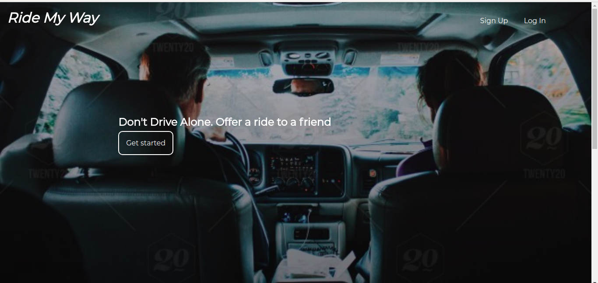
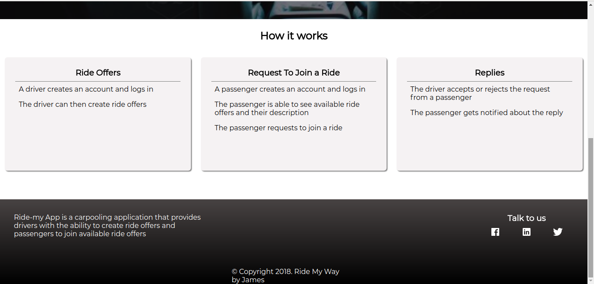

[](https://travis-ci.org/MasherJames/Ride-My-Way)
[](https://coveralls.io/github/MasherJames/Ride-My-Way?branch=ch-challenge-two-develop-158460445)

# Ride-My-Way

Ride-my-way App is a carpooling application that provides drivers with the ability to create ride offers
and passengers to join available ride offers.

### _Home page_



**How it works**

- A driver creates an account and logs in
- The driver creates ride offers
- A passenger creates an account and logs in
- A passenger is able to view all available ride offers and can request to join
- The driver accepts or rejects the request from the passenger
- The passenger is notified about the response

### _How it works_



**Installation**

```
git clone git@github.com:MasherJames/Ride-My-Way.git
```

- cd Ride-My-Way/ui
- Open `index.html` in your favorite browser
